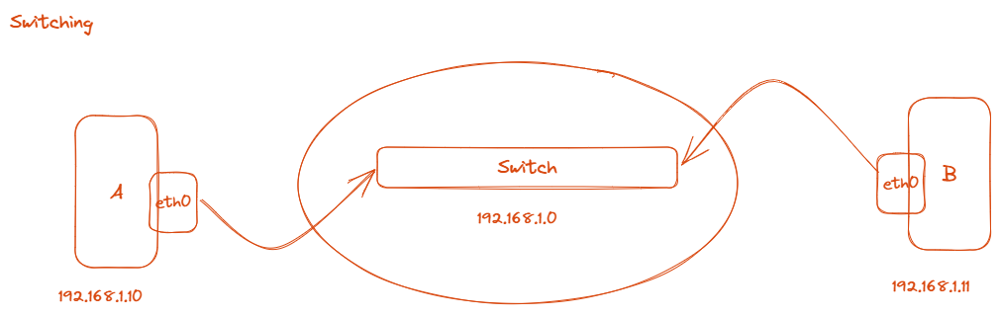
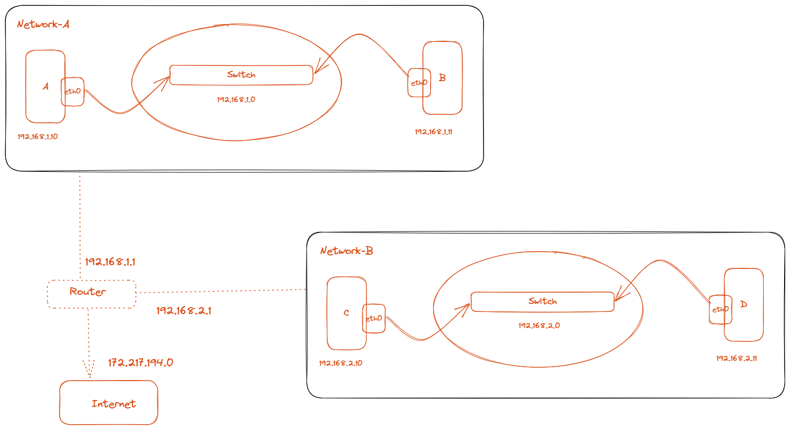
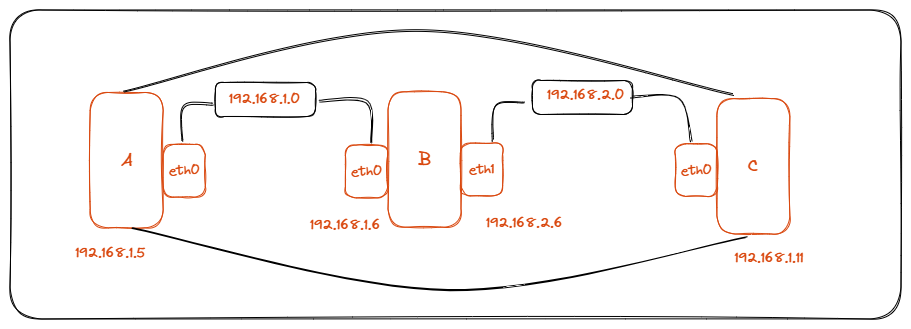
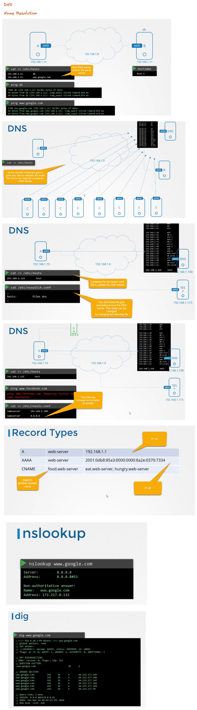
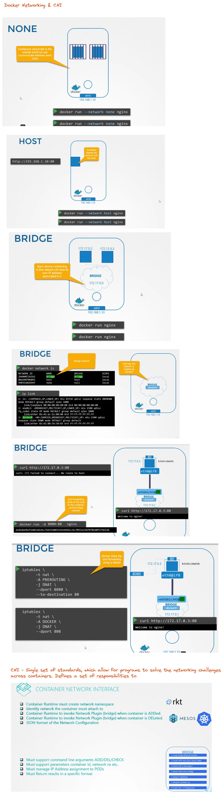

# Linux Networking Basics

## Switching




```shell
# Fetch the interfaces on a computer
ip link

# List the IP addresses assigned to the interfaces
ip addr

# Set IP address to an interface
ip addr add <ip-addr> dev <interace> 

# Connect A with Switch using interface
ip addr add 192.168.1.10/24 dev eth0

# Connect B with Switch using interface
ip addr add 192.168.1.11/24 dev eth0
```



```shell
# Displays the current routing table
# Both the commands perform the same operation
ip route 
route

# Add information to the routing table
ip route add 


# Connecting Network-B to communicate with Network-A 
ip route add 192.168.2.0/24 via 192.168.1.1

# Connecting Network-A to communicate with Network-B
ip route add 192.168.1.0/24 via 192.168.2.1

# Connecting Network-B to the internet
ip route add 172.217.194.0/24 via 192.168.2.1

# Connecting Network-B to any destination
ip route add default via 192.168.2.1
```



```shell
# Displays the current route information
route

# A -> B -> C 
ip route add 192.168.2.0/24 via 192.168.1.6

# C -> B -> A
ip route add 192.168.1.0/24 via 192.168.2.6

# Even after allowing the above the packets
# will not be forwarded until we specifcy that
# packets from eth0 can move to eth1
# Note the value of the forward is set to 0
# Setting the value to 1 allows for packets to flow thru
# however on reboots this value gets reset
# Hence the best way to do that would be to 
# modify /etc/sysctl.conf file to set "net.ipv4.ip_forward=1
cat /prod/sys/net/ipv4/ip_forward

```

# DNS



* Core DNS is used by K8s for name resolution

# Docker and CNI

