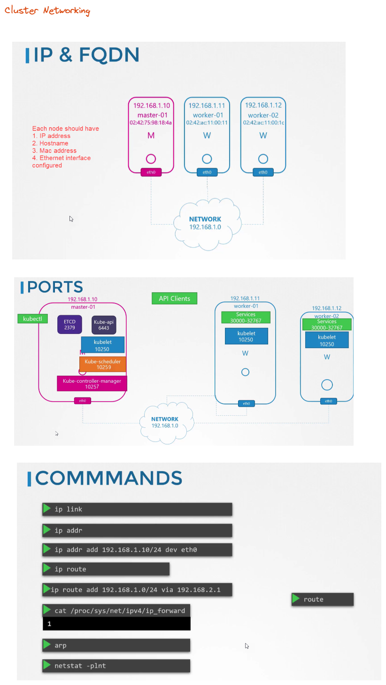

# Networking



```shell
# Finding the network interface
ip a | grep <ip-addr>

# Finding the mac address
ip a
ip link show <interface>

# Shows default route
ip route show default

# Checking the ports
netstat -atupln | grep etcd
```