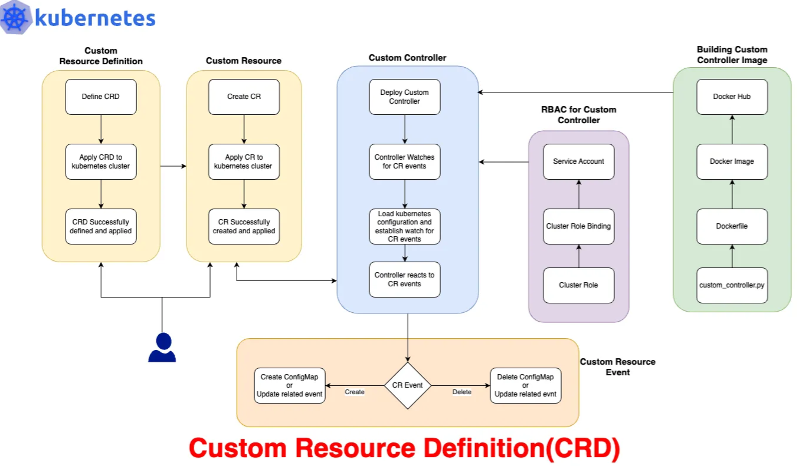
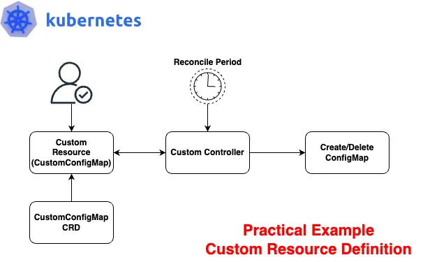

# Custom Resource Definition

## What is that we want to create?

Create a CRD for a custom resource called CustomConfigMap. 
Whenever an instance of this custom resource is created, or deleted, 
a custom controller will create, or delete a corresponding ConfigMap.

## The process
* Creating the Custom Resource Definition (CRD)
* Creating the Custom Resource (CR)
* Writing the Custom Controller
* Dockerizing the Controller
* Deploying the Controller
* Setting up RBAC for our custom controller(Role-Based Access Control)
* Single command to setup(Optional)
* Testing the Example
* Testing Results

Reference: https://medium.com/@muppedaanvesh/a-hand-on-guide-to-kubernetes-custom-resource-definitions-crds-with-a-practical-example-%EF%B8%8F-84094861e90b