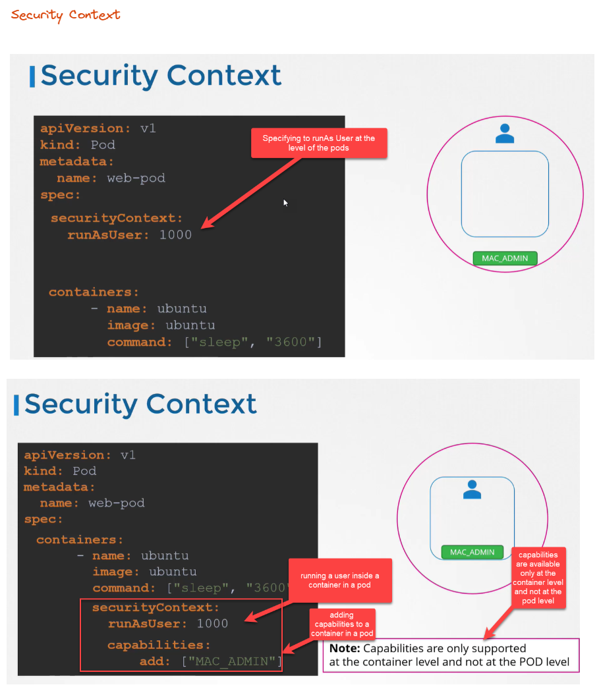

# Security Contexts

* Security context similar to docker security context
* The context can be configured at the 
  * pod level - applies to all containers running inside the pod
  * container level - applies only to the containers, this overrides any setting on the pod.

