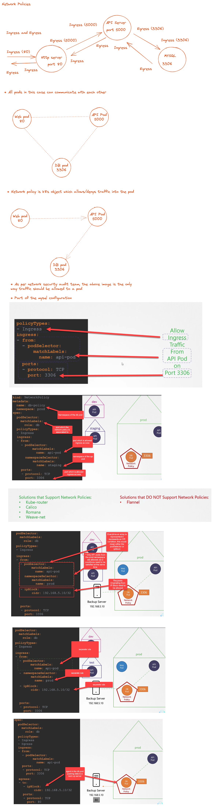

# Network Policies

* All pods across nodes can communicate with each other because the default rule is "All Allow"

## References
* https://github.com/ahmetb/kubernetes-network-policy-recipes
* https://github.com/ahmetb/kubectx